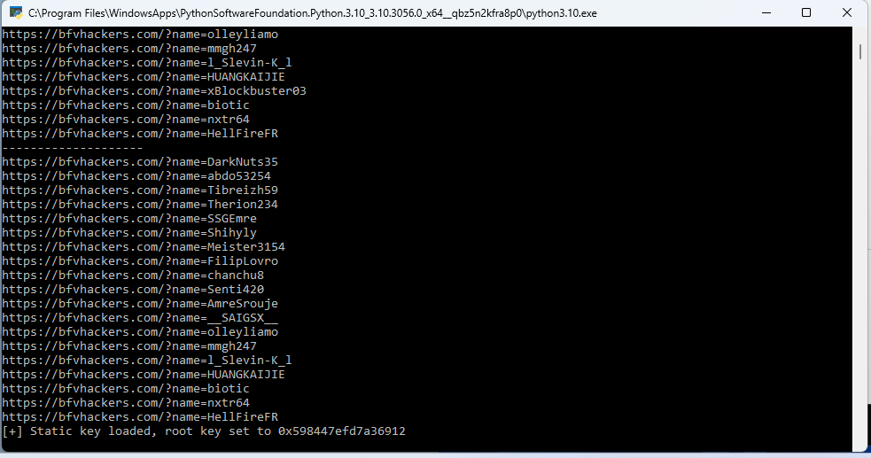

# Battlefield V player lister
#### This repo uses [xx4-bfv-aimassist](https://github.com/exex4/xx4-bfv-aimassist) as its core!
#### What is its purpose?:
 - ##### List all players in the game with quick links to bfvhackers.com
#### Install:
1. ##### [bfv-playerlist](https://github.com/perheld/bfv-playerlist)
2. ##### [Python](https://www.python.org/downloads/) and add to path

#### But why?!
I got sick and tired of always discovering that cheaters are in the game when its nearing the end in firestorm.

#### Future:
 - Automatically check players using the bfvhackers API and get green/red text if there are bad players

#### What does it look like?

