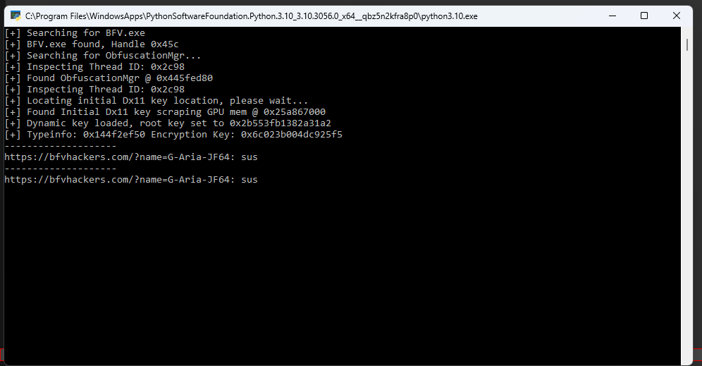

# Battlefield V player lister
#### This repo uses [xx4-bfv-aimassist](https://github.com/exex4/xx4-bfv-aimassist) as its core!
#### What is its purpose?:
 - ##### List all players in the game with that arent legit
#### Install:
1. ##### [bfv-playerlist](https://github.com/perheld/bfv-playerlist)
2. ##### [Python](https://www.python.org/downloads/) and add to path

#### But why?!
I got sick and tired of always discovering that cheaters are in the game when its nearing the end in firestorm.

#### What does it look like?

#### Warning
I dont take any responsibility for your account being banned by using this. Since at its core its about reading memory from the BFV process and that is the same procedures at aimbots use fairplay might think this is bad. I dont know. I have been using this for a while and will probably continue in doing so.
